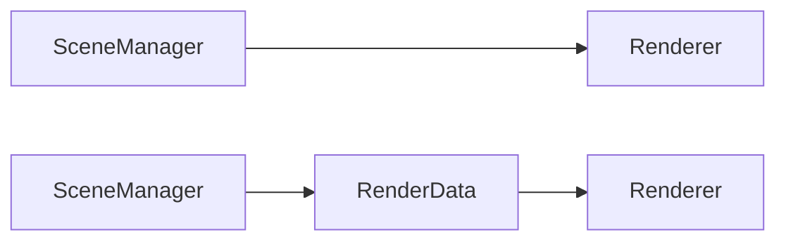

# 0008 - Render Data

# Durum
Objeleri render ederken renderer ve scenemanager sınıfları arasında objeler hakkında veri alışverişi oluyordu. Fakat zamanla bu durum sınıfların birbirilerine daha çok bağladı. Renderer sınıfı SceneManager'ın iç çalışma mekanizmaları hakkında aynı şekilde SceneManager da Renderer hakkında bilgi sahibiydi. 

# Karar 
Bu iki sınıfın birbirine olan bağımlılığını azaltmak için bu veriyi direk göndermek yerine bir ara katmanda paketleyip gönderecektik.
Eskiden veriyi direk gönderirken yeni durumda RenderData'da paketleyip bu şekilde gönderiyor olacağız. 

# Çıktılar
## Pozitif 
- Yapılan değişiklikler sonucu bazı recursive yapılardan kurtulduk. 
- Daha derli toplu bir hale geldiği için yönetim kolaylaştı. 

## Negatif
- Bazı elemanları gereksiz copy ediyoruz. 
- Her frame de tekrar tekrar oluşturmak gereksiz olabilir. Fakat şuanlık ciddi anlamda negatif bir etkisini görmedim. 

## Şuanki Durum
SceneRenderData sınıfı altında objeler için RenderItem ve ışıklar için LightItem vektörleri tutuluyor. 

    struct RenderItem
    {
        Model* model{};
        glm::mat4 transform{ 1.0f };
        uint32_t entityIndex{}; // for selection pass
        bool isSelected{false};
    };
    struct LightItem
    {
        class Light* light{};
        glm::mat4 transform{ 1.0f };
        uint32_t entityIndex{}; // for selection pass
        bool isSelected{false};
    };

    struct SceneRenderData{
        std::vector<RenderItem> renderItems;
        std::vector<LightItem> lightItems;
    };