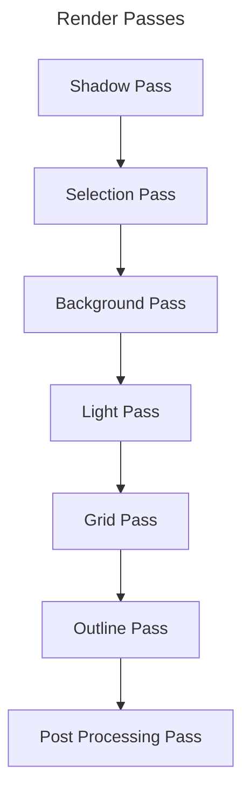

# 0013 - Mermaid

## Status
Accepted 

## Context
- Programın akışını daha iyi tasarlamak ve var olan yapıyı hatırlamak amacıyla diyagram çizmemiz gerekli. 
- Repoya entegre olabilmeli. Çünkü daha önceki repoya entegre olmayan diyagramımız Hakkın rahmetine kavuşmuş durumda. 
- Bu tip şeyleri sonraya ötelemenin pek bir anlamı yok çünkü programın bir sonunun geleceğini pek düşünmüyorum. Ben devam ettirmek istedikçe ve ömrüm oldukça devam edecek.  

## Decision
Mermaid ile devam etme kararı aldım. Çünkü
- VS Code ile kullanımı rahat. 
- Markdown ile rahtalıkla repoya gömülebiliyor.
- İstediğim diyagram türlerini destekliyor. 

## Alternatives considered
- DrawIO -> Güzel fakat repo ile entegre etmek sıkıntı olabilir. 
- Mermaid alternatifi başka programlar -> Belki daha iyileri vardır olabilir fakat bu benim istediğim tüm özelliklere sahip. Derinlemesine bir araştırmaya girmek istemiyorum. İşimi gören sistemle devam edeceğim. 

## Rationale
Mermaid 

## Consequences
### Positive
- Sadece yazıya kıyasla diyagramların eklenmesi dökümantasyonun kalitesini artırıyor. Bu da muhtemelen uzun vadede programın kalitesini kayda değer miktarda yukarı çekecek. 
- 

### Negative
- Ekstra syntax ekstradan yazılması gereken diyagramlar. 
- Öğrenme eğrisi

## Notes
Aşağıda mermaid ile yapılmış bir örnek bulunmaktadır: 

